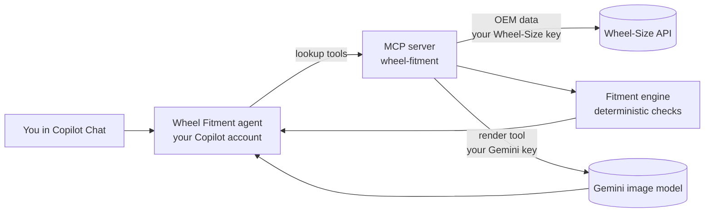
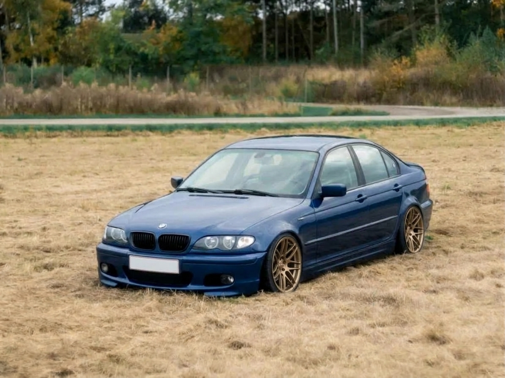

# How the Wheel Fitment Agent works

This page walks through one real run: a **2001-2005 BMW 330i (E46 saloon, EU market)** and a set of **bronze 19" multi-spoke wheels**. Every output below came from the running MCP server.

## Overview



- Copilot (the LLM) talks to you, decides which tool to call and explains the results.
- The MCP server does the real work: fetching factory data and running the maths. The fitment verdict is calculated in Python, not guessed by the model.
- The render tool is optional and only appears when a Gemini key is configured.

## Step 1: identify the car

You say: *"2003 BMW 330i saloon, EU. I want 19x8.5 ET30 on the front and 19x10 ET40 on the rear."*

The agent calls `search_models`, `list_modifications` and `get_oem_specs` so it never guesses a trim. For this car, `get_oem_specs` returns:

| | |
|---|---|
| Vehicle | BMW 3 Series 330i (2001-2005) |
| Bolt pattern | 5x120 |
| Centre bore | 72.6 mm |
| Fasteners | Lug bolts, M12 x 1.5, 100 Nm |

Factory wheel options for this car:

| Wheel | Tyre | Axle |
|---|---|---|
| 7Jx17 ET47 (standard) | 205/50ZR17 | all round |
| 8Jx17 ET47 | 225/45ZR17 | all round |
| 8Jx18 ET47 / 8.5Jx18 ET50 | 225/40ZR18 / 255/35ZR18 | staggered |
| 7.5Jx17 ET41 / 8.5Jx17 ET50 | 225/45ZR17 / 245/40ZR17 | staggered |

## Step 2: check the proposed wheels

The agent calls `check_wheel_fitment` with the sizes you gave (tyres assumed as 225/35R19 front and 265/30R19 rear):

```json
{
  "front": { "rim_diameter": 19, "rim_width": 8.5, "rim_offset": 30, "tire": "225/35R19",
             "bolt_pattern": "5x120", "centre_bore": 72.6 },
  "rear":  { "rim_diameter": 19, "rim_width": 10,  "rim_offset": 40, "tire": "265/30R19",
             "bolt_pattern": "5x120", "centre_bore": 72.6 }
}
```

The engine compares each axle against the closest factory wheel and checks bolt pattern, centre bore, tyre diameter, rim/tyre width match and how far the wheel and tyre sit in or out of the factory position.

**Result: `WILL NOT FIT`**

| Axle | Compared with | Further out | Further in | Tyre diameter | Findings |
|---|---|---|---|---|---|
| Front | 8Jx17 ET47, 225/45ZR17 | 23 mm | none | +1.0% | Fail: likely to poke past the arch or rub. Info: 17" to 19" change, check brake clearance |
| Rear | 8.5Jx18 ET50, 255/35ZR18 | 34 mm | 14 mm | +0.9% | Fail: pokes past the arch. Fail: likely to hit suspension or brakes |

Bolt pattern, centre bore and overall tyre diameter pass.

## Step 3: the agent explains it

Copilot turns the numbers into advice, for example:

> These won't fit as specified. The front sits about 23 mm further out than a factory 8J ET47 wheel, and the rear sits 34 mm further out and 14 mm further in, so it would poke through the arch and likely hit the suspension. Bolt pattern (5x120) and centre bore (72.6 mm) are fine. A higher offset on both axles, or a narrower rear wheel, would bring it back in range. These are calculated estimates; confirm on the car, especially if it is lowered.

Verdicts are always one of:

| Verdict | Meaning |
|---|---|
| `SHOULD FIT` | No problems found |
| `FITS WITH CAVEATS` | Fits, but check things like arch or brake clearance, speedo error, or hub rings |
| `WILL NOT FIT` | A hard problem: wrong bolt pattern, bore too small, or poke/push beyond tolerance |

## Step 4: preview the wheels (optional)

Give the agent a photo of the car and a photo of the wheel. The `render_car_with_wheels_tool` sends both to Gemini, which replaces the wheels in the car photo and leaves everything else alone.

| Input car photo | Input wheel | Output |
|---|---|---|
| Blue E46 saloon with silver mesh wheels | Bronze 19x11 multi-spoke |  |

The car, background and lighting are unchanged, and the new wheels follow the car's perspective on both axles. The number plate has been blanked automatically: every render prompt includes a privacy rule that removes licence plates and other personal details (faces, VINs, addresses, names, phone numbers, personal stickers). You can also describe the wheels or the car in words instead of supplying photos. Renders are saved to `~/.wheel-fitment-agent/renders/`.

Gemini's image filters sometimes refuse a request (for example `IMAGE_RECITATION`), so the tool retries up to three times before reporting an error.

> The render shows how the wheels look. It does not show whether they fit; that is what the fitment check is for. In this example the render used a 19x11 wheel photo, while the fitment check used the 19x8.5 and 19x10 sizes. The offset of the 19x11 wheel was not supplied, so it was not checked.

## What it costs

- **Wheel-Size API:** this whole run used 2 of the 300 monthly calls (the OEM lookup, then reuse from cache). The server tracks usage in `~/.wheel-fitment-agent/wheelsize_usage.json`, and `wheelsize_api_usage` reports it.
- **AI chat:** uses your own GitHub Copilot allowance.
- **Rendering:** each image uses your own Gemini API credits.

## Limits

- Fitment results are estimates built from factory data. They do not account for lowering, camber, aftermarket suspension or big brake kits.
- The poke/push thresholds and the tyre-width rule are rules of thumb in `wheel_fitment/fitment.py`.
- The Wheel-Size free quota is small, so repeated lookups for the same car are cached within a session.
